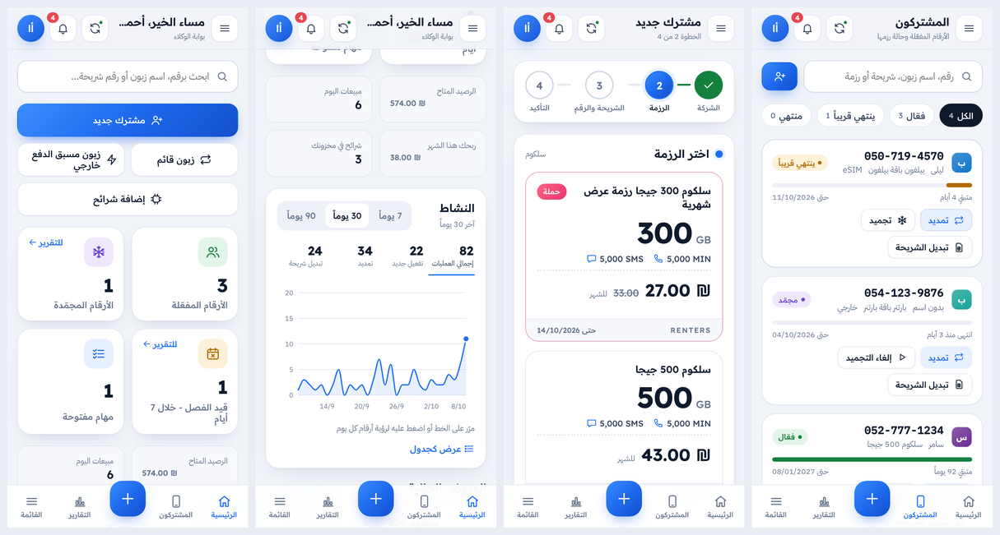
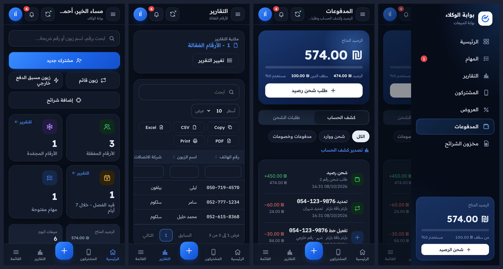
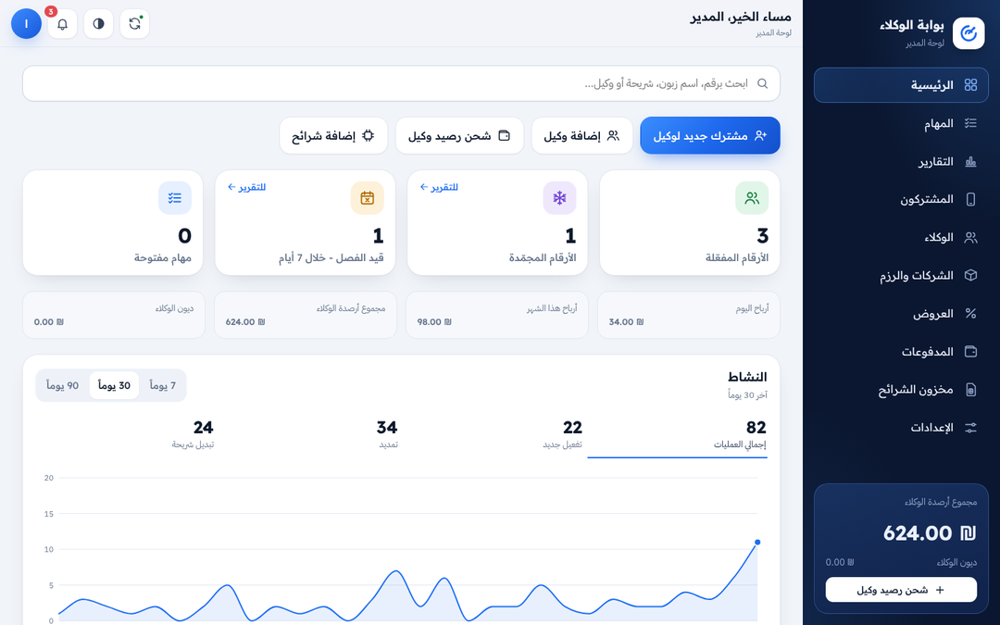

# بوابة الوكلاء

تطبيق للهاتف (PWA يُثبَّت من المتصفح على الشاشة الرئيسية) مع خادم خاص به، لبيع خطوط سلكوم وبارتنر وبيلفون وهوت موبايل عبر وكلاء.
لكل وكيل اسم مستخدم وكلمة مرور، والمدير يتحكم بالأسعار والأرصدة والرزم.





> الصور من بيانات تجريبية.

## ما الذي يفعله

**للوكيل**
- **الرئيسية:** تحية حسب الوقت، بحث سريع (رقم، اسم زبون، شريحة)، أزرار سريعة: مشترك جديد، زبون قائم، زبون مسبق الدفع خارجي، إضافة شرائح؛
  بطاقات: الأرقام المفعّلة، المجمّدة، قيد الفصل خلال 7 أيام، المهام المفتوحة؛ رسم «النشاط» لآخر 7/30/90 يوماً مع تفاصيل كل يوم.
- **مشترك جديد في 4 خطوات** مع «ملخص الطلبية» يتحدّث في كل خطوة: الشركة ← الرزمة (العروض تظهر بعلامة «حملة») ← الشريحة والرقم (eSIM، تحويل رقم، المدة 1–12 شهراً) ← التلخيص وسعر الزبون وربحك.
- **الشريحة:** امسح باركود الشريحة بالكاميرا (Chrome على أندرويد)، أو اخترها من مخزونك بلمسة، أو اكتبها. تتعرّف المنصّة على الشركة من أول أرقام الشريحة وتمنع تفعيل شريحة شركة على رزمة شركة أخرى.
- **زبون قائم:** تمديد رزمة أي رقم؛ يُضاف التمديد من تاريخ الانتهاء الحالي فلا يضيع على الزبون أي يوم.
- **المشتركون:** كل رقم مع شريط الأيام المتبقية، وتجميد/إلغاء تجميد، تبديل الشريحة، فصل، تعديل بيانات الزبون، ومشاركة التفاصيل عبر واتساب. رمز eSIM يظهر للزبون كـ QR.
- **المهام:** الرزم التي تنتهي قريباً (للتمديد قبل الفصل) وطلباتك للمدير.
- **المدفوعات:** الرصيد المتاح وسقف الدين، كشف الحساب، وطلب شحن رصيد مع صورة الإيصال.
- **التقارير:** مكتبة تقارير (الأرقام الفعّالة، شرائح بانتظار الفصل، المنتهية، المجمّدة، التفعيلات، التمديدات، تبديل الشرائح، كشف الحساب، المبيعات حسب الرزمة، أرباحك من الزبائن، مخزون الشرائح)
  مع بحث وتصفية لكل عمود وترتيب وترقيم صفحات وتصدير Copy / CSV / Excel / PDF / Print.
- **العروض، مخزون الشرائح، التنبيهات** (رصيد منخفض، أرقام تنتهي، عروض جديدة، ردود المدير)، والوضع الداكن.

**للمدير**
- كل ما سبق لكل الوكلاء، مع التكلفة والربح.
- **الوكلاء:** إضافة/تعديل/إيقاف/حذف، اسم المستخدم وكلمة المرور، الرصيد (شحن، خصم، تعيين)، **سقف دين** لكل وكيل، نقل رصيد بين وكيلين،
  و**سعر خاص لكل وكيل لكل رزمة** مع أداة «خصم على كل الرزم».
- **الشركات والرزم:** الشعار (رفع صورة) واللون وبادئات الشرائح؛ الرزمة: الإنترنت بالجيجا، الدقائق، الرسائل، وسم مثل RENTERS، التكلفة والسعر.
- **العروض:** سعر خاص وتاريخ بداية ونهاية، وتحذير إن كان سعر العرض أقل من التكلفة. يصل إشعار للوكلاء عند النشر.
- **المهام:** طلبات الشحن (مع الإيصال)، وطلبات تحويل الأرقام وeSIM (يرفق المدير رمز QR). رفض طلب التفعيل يعيد المبلغ للوكيل كاملاً.
- **الإعدادات:** اسم التطبيق، أيام التنبيه قبل الانتهاء، حد الرصيد المنخفض، وتنزيل نسخة احتياطية كاملة بضغطة.

كل التحقق (الصلاحيات، الرصيد وسقف الدين، السعر، تكرار الرقم أو الشريحة) يتم في الخادم داخل معاملة واحدة، فلا يستطيع الوكيل تغيير سعره أو رصيده.

> عمليات التجميد وتبديل الشريحة والفصل وتحويل الأرقام تُسجَّل في المنصّة؛ التنفيذ لدى شركة الاتصالات يبقى كما هو (المنصّة غير مربوطة بأنظمة الشركات).

## التشغيل

يحتاج Node.js 22.13 أو أحدث. لا توجد مكتبات لتثبيتها.

```bash
cd agents-app
ADMIN_USERNAME=admin ADMIN_PASSWORD='كلمة-مرور-قوية' npm start
# افتح http://localhost:3000
```

- في أول تشغيل يُنشأ حساب المدير من `ADMIN_USERNAME` و`ADMIN_PASSWORD`. بدون `ADMIN_PASSWORD` تُولَّد كلمة مرور وتُطبع في سجل الخادم.
- البيانات في `data/agents.db` (غيّر المسار بـ `DB_FILE`). نزّل نسخة احتياطية من «الإعدادات» بانتظام.
- تبدأ قاعدة البيانات بشركات سلكوم وبارتنر وبيلفون وهوت موبايل ورزم سلكوم 500/300/100 جيجا بسعر صفر؛ الرزمة بسعر صفر لا تظهر للوكلاء حتى تحدد سعرها.
- قاعدة بيانات من الإصدار الأول تُرقّى تلقائياً عند التشغيل.

### بـ Docker

```bash
docker build -t agents-app .
docker run -d -p 3000:3000 -v agents-data:/data -e ADMIN_PASSWORD='كلمة-مرور-قوية' agents-app
```

## النشر على الإنترنت

ليستعمله الوكلاء من هواتفهم شغّل الخادم على استضافة بعنوان **HTTPS** (مثل Render أو Railway أو Fly.io أو أي VPS) مع قرص دائم لملف قاعدة البيانات.
الكاميرا (مسح الباركود) والتثبيت على الشاشة الرئيسية يحتاجان HTTPS.
بعدها يفتح الوكيل الرابط في Chrome (أندرويد) أو Safari (آيفون) ويختار «إضافة إلى الشاشة الرئيسية».

## البنية

- `server.js` — خادم HTTP، الملفات الثابتة، رؤوس الأمان (CSP).
- `src/` — قاعدة البيانات والترقية (`db.js`)، منطق الأرصدة والأسعار والشرائح (`domain.js`)، والمسارات في `src/routes/`.
- `public/` — الواجهة: `js/main.js` (الهيكل والتنقل)، `js/views/*` (الصفحات)، `css/app.css` (نظام التصميم الفاتح والداكن)، `sw.js` (العمل دون اتصال).
- `test/` — اختبارات الواجهة البرمجية وترقية قاعدة بيانات الإصدار الأول.

```bash
npm test
```
